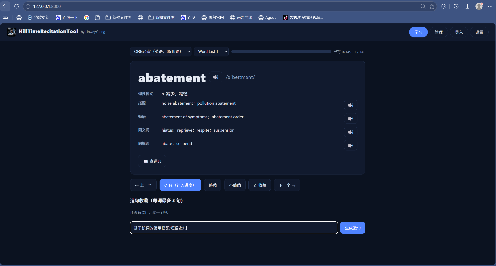

# KTRT（KillTimeRecitationTool）

> 一个正在备考 GRE 的人，嫌弃市面上的背词软件「背什么书、怎么背、背完怎么练」全被规定死，
> 干脆自己动手搞了个顺手的：一页一词，词义、搭配、短语、同反义词、同根词全摊开；
> 想造句就让 AI 来，造完的句子存进收藏；词库想导哪本就导哪本。
> 名字叫 KillTimeRecitationTool——把背单词这件「杀时间」的事，变成真正属于自己的时间。

开发者：HoweyYueng。

## 它有什么不一样

- **AI 帮你造句，还帮你记住**：输入一句中文提示（比如「他努力弥补过错」），AI 用当前单词造出英文句、高亮目标词、配好中文翻译，存进你的造句收藏——背单词不再只是「看」，而是真的会用。
- **想背哪本，背哪本**：GRE、雅思、四六级、法语……任何单词书，整理成 Excel / CSV / 纯文本就能导入；搭配、短语、同反义词、同根词这些「扩展信息」AI 自动补齐。
- **离线也能查词**：内置 ECDICT 离线词典（77 万词条），没网也能查。
- **读给你听**：edge-tts 语音朗读，英语、法语都有专属发音，别的语言也留好了口子。
- **数据只属于你**：SQLite 本地存储，进度、收藏、造句全在自己电脑上，不上传、不外泄。
- **不绑定任何 AI**：厂商、模型、Key 全部可自由切换（DeepSeek、豆包、GPT、Gemini、Claude、千问、Grok 等）。

## 功能展示

AI 自定义造句：在输入框填入中文提示词，AI 用当前单词生成句子并高亮目标词，保存进个人造句收藏（每词最多 3 句）。




## 快速开始

**方式一：一键安装（推荐，无需 Python）**

从 [GitHub Releases](https://github.com/HoweyYang/KTRT/releases) 下载安装包，双击安装即可：

- `KTRTSetup-0.1.0.exe`：**完整版**，内置 GRE必背 词库，装完即用。
- `KTRTSetup-lite-0.1.0.exe`：**纯净版**，不含任何词库，按需自行导入。

安装后自动创建桌面快捷方式，启动即自动打开使用页面。

> **词库独立下载**：Release 附件另提供 `GRE_Wordbook.xlsx`（GRE必背，6519 词）与 `IELTS_Wordbook.xlsx`（雅思词汇真经，3608 词），
> 想背哪本下载哪本，到「导入」页手动导入即可（具体步骤见 [docs/使用教程.md](docs/使用教程.md)）。

**方式二：源码运行（开发）**

环境：Python 3.10+

```bash
# Windows：直接双击 KTRT.bat（首次运行自动建虚拟环境并安装依赖）
# 或手动：
python -m venv venv
venv\Scripts\activate
pip install -r requirements.txt
python launcher.py
```

启动后浏览器打开 http://127.0.0.1:8000。

> `127.0.0.1` 是每台电脑自己的本机回环地址——程序在你自己的电脑上运行，数据只存本地，不上传。

> **API Key**：本项目不内置、不提交任何 API Key。首次使用请在「设置」页填写你自己的 Key，并可自由切换厂商/模型。

## 项目结构

```
KTRT.bat            一键启动
launcher.py         启动器（准备词库→启动服务→打开浏览器）
backend/            FastAPI 后端（数据库/导入/AI/朗读）
frontend/static/    前端页面（原生 HTML/CSS/JS）
data/               本地数据（不入库，见 data/README.md）
docs/               设计文档、路线图、教程
```

## 词库导入

把任意单词书整理成标准 Excel 后即可导入。列格式、AI 提取提示词见 [docs/Excel生成教程.md](docs/Excel生成教程.md)，程序操作见 [docs/使用教程.md](docs/使用教程.md)。

## 路线图

校验语料库 → LLM Wiki 知识图谱 → exe 桌面版 → 网站部署 → 微信小程序，详见 [docs/TO_BE_CONTINUED.md](docs/TO_BE_CONTINUED.md)。

## 许可

MIT License，见 [LICENSE](LICENSE)。

> 说明：`data/` 目录（含词库与 API Key）不随仓库分发，请自行准备词库。
